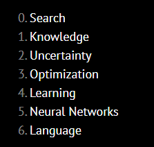
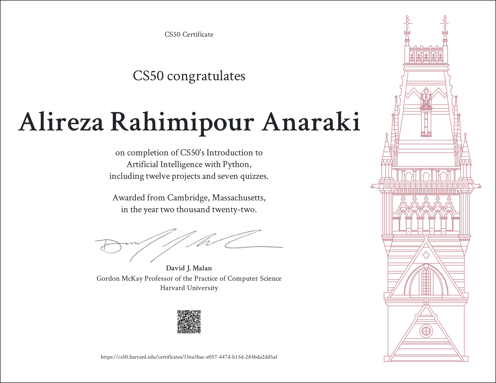

Harvard CS50ai — 2022 Solutions 😎
=====================

-   [Course Link](https://cs50.harvard.edu/ai/2020/)
-   [My Certificate](https://cs50.harvard.edu/certificates/f36a5bac-e057-447d-b15d-284bda2dd5af)

## What is it?

This course explores the concepts and algorithms at the foundation of modern artificial intelligence, diving into the ideas that give rise to technologies like game-playing engines, handwriting recognition, and machine translation. Through hands-on projects, students gain exposure to the theory behind graph search algorithms, classification, optimization, reinforcement learning, and other topics in artificial intelligence and machine learning as they incorporate them into their own Python programs. By course’s end, students emerge with experience in libraries for machine learning as well as knowledge of artificial intelligence principles that enable them to design intelligent systems of their own.

-   ✅ Videos
-   ✅ Problem Set & Quiz
-   ✅ Slides & Notes
-   ✅ Auto Grader

## Works

This repository is used to store my solutions to weekly assignments. You can click on the folder to see a detailed description of weekly assignments and my achievement.

> A quick word on [Academic Honesty](https://cs50.harvard.edu/x/2022/honesty/). While these solutions will help you to get through the course without too much effort, you should do your best to figure out a working solution yourself before taking a look at any of my solutions. Investing your time and energy into solving the problem sets yourself is in my opinion the only way to eventual mastery.

Go ahead and take a peek at the solutions.

## Table of Contents
- [Problem Set 0: Search](/Week0)
  * [Quiz](/Week0/quiz)
  * [Degrees](/Week0/degrees)
  * [Tic Tac Toe](/Week0/tictactoe)
- [Problem Set 1: Knowledge](/Week1)
  * [Quiz](/Week1/quiz)
  * [Knights](/Week1/knights)
  * [Minesweeper](/Week1/minesweeper)
- [Problem Set 2: Uncertainty](/Week2)
  * [Quiz](/Week2/quiz)
  * [Heredity](/Week2/heredity)
  * [Page Rank](/Week2/pagerank)
- [Problem Set3: Algorithms](/Week3)
  * [Quiz](/Week3/quiz)
  * [Crossword](/Week3/crossword)
- [Problem Set 4: Memory](/Week4)
  * [Quiz](/Week4/quiz)
  * [Shopping](/Week4/shopping)
  * [Nim](/Week4/nim)
- [Problem Set 5: Neural Networks](/Week5)
  * [Quiz](/Week5/quiz)
  * [Traffic](/Week5/traffic)
- [Problem Set 6: Python](/Week6)
  * [Quiz](/Week6/quiz)
  * [Parser](/Week6/parser)
  * [Questions](/Week6/questions)

I finished this course on November 2, 2022.
The picture below shows my certificate after completing all the assignments:

